# My Experience Creating My Webpage using DevOps Practices

In this repository, I built the first basic webpage, set up a full CI/CD pipeline between environments, and then upgraded my webpage design using DevOps practices. Here's the final result if you'd like to check it out: [jcfernandezpr.co](https://jcfernandezpr.co). 


Although I already have some professional experience with DevOps, I did want to share some of my thoughts on diving a little bit deeper into web design and DevOps. This README can also be seen as a guide so you can also create or improve the whole lifecycle of your page.

To do this I created two repositories:

1. This DevOps repository is the one in charge of the webpage code and DevOps practices such as Git versioning, Docker to containerize the web application, and instructions on how I set up CI/CD pipelines across different environments for dev, staging, and production. The whole final workflow is that every time a code change PR is opened to any deployment branches, the CI pipeline automatically run the tests to check everything works fine; after merging to the deployment branch, the CD pipeline builds the Docker web app and pushes it into a cloud container registry to deploy it later into a single machine or a Kubernetes cluster.

2. The [GitOps repository](https://github.com/jcfernandezpr/infra-gitops) is the one in charge of the infrastructure where the application runs. The GitOps repo uses Infrastructure as Code (IaC) practices to deploy and maintain the server(s) that hosts the app. I wrote two sections, the first one is how to do it for single instance machines using cloud instances and the other one is for setting up Kubernetes and how to deploy the Docker image in both of them. Feel free to jump to the repo if you already have a containerized web app.

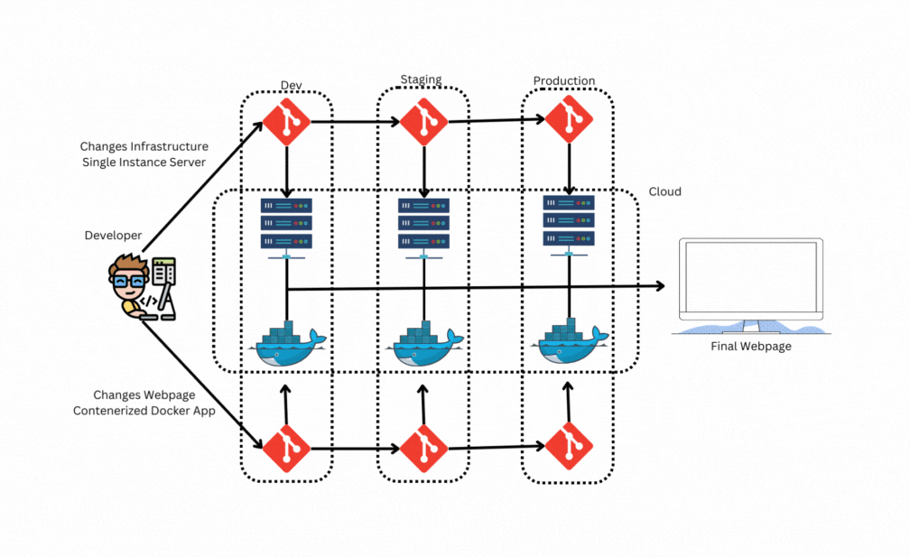

## Pre-requisites

To understand what I did, you'll need some basics notions of:

1. Basic web development ([HTML](https://developer.mozilla.org/docs/Learn/Getting_started_with_the_web/HTML_basics), [CSS](https://developer.mozilla.org/docs/Learn/Getting_started_with_the_web/CSS_basics), [Javascript](https://developer.mozilla.org/docs/Learn/Getting_started_with_the_web/JavaScript_basics)).
2. Basic Linux scripting ([bash](https://linuxconfig.org/bash-scripting-tutorial-for-beginners)) and versioning skills ([Git and GitHub](https://docs.github.com/en/get-started/using-git/about-git)).
3. Basic cloud computing fundamentals ([AWS](https://aws.amazon.com/getting-started/cloud-essentials/), [Azure](https://learn.microsoft.com/en-us/training/modules/intro-to-azure-fundamentals/), or [GPC](https://cloud.google.com/docs/overview)).
4. Basic understanding of what [Docker](https://docs.docker.com/get-started/) is.

> Note: I used Ubuntu as my Operating System and shell terminal. If you are using Windows you can set up the [Windows Subsystem for Linux (WSL)](https://learn.microsoft.com/en-us/windows/wsl/install). To set WSL just watch [this video up until minute 8:26](https://www.youtube.com/watch?v=wjbbl0TTMeo) to know how to do it. If you're using macOS, the process will be almost straightforward except for the package manager, so make sure to install `homebrew` by following [this page](https://brew.sh/index), and every time you see `apt` in this tutorial replace it with `brew` for macOS.

> Another note: For my cloud provider, I used [Amazon Web Services (AWS)](https://aws.amazon.com) so make sure you have a valid AWS Account. If you wish to use another cloud feel free to adapt the code changes to the specific vendor CLI/SDK. I'll be updating the guide with other clouds as long as I'll be testing them.

## First MVP Webpage Setup

The first thing I did was create the first functional webpage so I can start building on top of it.

### Create the MVP Page

I started by creating a new folder on my computer where I developed my first webpage.

```bash
# Create folder for webpage, change the name!
mkdir webpage-devops

# Go inside the new folder
cd webpage-devops
```

Now inside the folder, I created my first webpage files.

> Note: I use [VSCode](https://code.visualstudio.com) as my IDE but feel free to use the one you like the most. There's a bunch out there so make sure you choose the best one for you.

I opened VSCode inside the folder and created my first HTML file that you can find [here](basic/index.html). Alternatively, you can create it from the terminal using:

```bash
# Create the HTML Page
touch index.html

# Add first content to the HTML file, feel free to put your own info
cat > index.html << EOF
<!DOCTYPE html>
<html lang="en">
  <!-- Header -->
  <head>
    <meta charset="UTF-8" />
    <meta http-equiv="X-UA-Compatible" content="IE=edge" />
    <meta name="viewport" content="width=device-width, initial-scale=1.0" />
    <title>Juan Camilo Fernandez Prato | Machine Learning Engineer</title>
  </head>

  <!-- Body -->
  <body>
    <nav>
      <h1>Juan Camilo Fernandez Prato</h1>
      <!-- Navigation Pane -->
      <ul class="navigation">
        <li><a href="#about" class="nav-link">About Me</a></li>
        <li><a href="#skills" class="nav-link">Skills</a></li>
        <li><a href="#projects" class="nav-link">Projects</a></li>
        <li><a href="#contact" class="nav-link">Contact</a></li>
      </ul>
    </nav>

    <!-- About Me -->
    <section class="hero" id="about">
      <div class="about-me">
        <h2 class="bio-title">About Me</h2>
        <p class="bio-text">
          ML/AI engineer, math rock lover, amateur gamer and basketball 🏀 fanatic.
        </p>
      </div>
    </section>

    <!-- Skills -->
    <section class="skills" id="skills">
      <h2 class="skill-header">My Top Skills</h2>

      <div class="skills-wrapper">
        <div class="ml-skills">
          <ul>
            <li>Python</li>
            <li>Tensorflow/Pytorch</li>
            <li>Numpy/Sklearn</li>
          </ul>
        </div>

        <div class="infra-skills">
          <ul>
            <li>Docker</li>
            <li>Kubernetes</li>
            <li>AWS</li>
          </ul>
        </div>
      </div>
    </section>

    <!-- Projects -->
    <section class="projects" id="projects">
      <h2 class="projects-title">Some of my Recent Projects</h2>
      <div class="projects-container">
        <div class="project-container project-card">
          <h3 class="project-title">LandingLens</h3>
          <p class="project-details">
            An intuitive software platform that makes an AI/deep learning-based computer vision model easy.
          </p>
          <a href="https://landing.ai/platform/" target="_blank" class="project-link">Check it Out</a>
        </div>
        <div class="project-container project-card">
          <h3 class="project-title">Customer Insights</h3>
          <p class="project-details">
            Get to know your customers and generate intelligent strategies to make your business profitable. Generate personalized campaigns based on behavior of your customers.
          </p>
          <a href="https://idata.com.co/products.html" target="_blank" class="project-link">Check it Out</a>
        </div>
      </div>
    </section>

    <!-- Contact -->
    <section class="contact" id="contact">
      <h2>Get In Touch With Me</h2>
      <div class="contact-form-container">
        </p>
          Email me at jcfernandezp@unal.edu.co
        <p>
      </div>
    </section>
  </body>
</html>
EOF
```

Once I had the HTML file, I opened it with my web browser to see how it was looking.

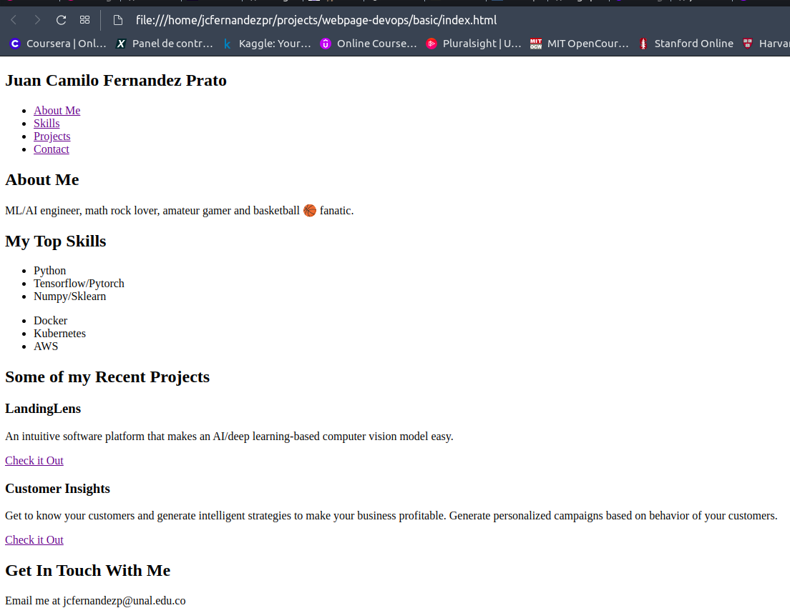

It's a horrible webpage to have but at least it's a starting point.

### Hosting My Page Locally

I know that the HTML page I was seeing wasn't being served into any port or service since it said `file:///...` on the address bar. This is not the optimal setup when hosting a web page since the other computers will not have (and shouldn't have) access to my filesystem. 

To address this, I needed some kind of service running in the background that exposes the HTML page in my local network. After a quick google search, I found that there are many ways to serve a page but I used the [Nginx](https://www.nginx.com) service to expose my page since it's one of the most popular options. 

To test it, I installed a local Nginx service by running:

```bash
# Install Nginx
sudo apt install nginx
```

Once it is installed, Nginx starts hosting a default webpage on port 80. I went to my browser and typed `localhost` (default to port 80) and I saw:

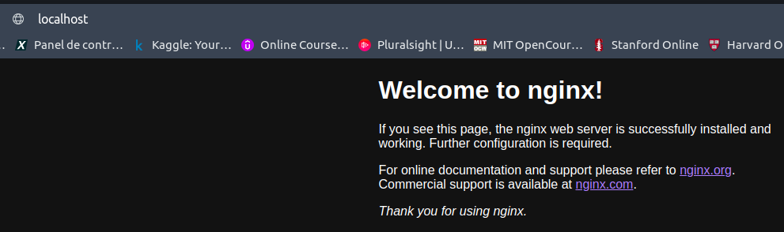

But how did I make the default page my page? I looked the Nginx docs and found that in this folder `/var/www/html` is where the default HTML file is. I deleted the default page and replaced it with mine.

```bash
# Delete default Nginx page
sudo rm /var/www/html/*.html

# Replace it with mine
sudo cp index.html /var/www/html/index.html
```

I refreshed the `localhost` page and saw my page displayed.

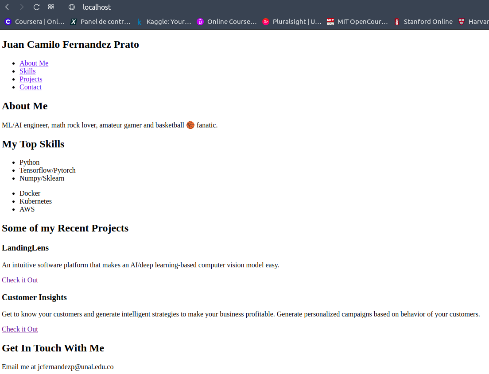

### Testing My Page Hosting

For a quick test that my page it's working, I just checked that the localhost curl request returns 200 HTTP code (OK Response). So I created a `test` folder with this simple [test file here](basic/test/test_curl.sh).

```bash
# Create test folder
mkdir test

# Create test file
touch test/test_curl.sh

cat > test/test_curl.sh << EOF
HTTP_RESPONSE_CODE=$(curl -s -o /dev/null -I -w "%{http_code}\n" localhost)
if [[ $HTTP_RESPONSE_CODE = 200 ]]; then
    exit 0
else
    # Exit Error Code
    echo "Error: Localhost did not return HTTP 200"  1>&2
    exit 1
fi
EOF
```

I ran the test script with the Ngnix service on and off to verify it and it worked well.

```bash
# Test it with the Nginx service on
# No output
bash test/test_curl.sh

# Turn off Nginx service and test it
# Should output Error: Localhost did not return HTTP 200
sudo systemctl stop nginx
bash test/test_curl.sh
```

I left my Nginx service off but feel free to turn it on again and explore it!

## Containerizing the WebApp

As you may have noticed, my web app has two major dependencies: Ubuntu/Linux as the OS and the Nginx as the hosting service. Since I need my application to be reproducible anywhere I want to run it, I used docker to bundle my webpage so I can easily deploy it in any machine that will host the page.

### Create the Dockerfile

First I created the [`Dockerfile` file](basic/Dockerfile) which is nothing more than a series of instructions for building my working app using Docker. To simplify my webpage deployment, I built it dependent on top of a fully tested [Nginx docker image](https://hub.docker.com/_/nginx) that is built on top of a Linux OS called Alpine, so I was able to remove the need of specifying the installation of Nginx as I did locally with `apt install`.

I also prepared for my deployment environments since I know that dev and staging environments will need the `test` folder while the production environment does not. So I put some logic for the `Dockerfile` depending on the environment passed as an argument.

```bash
# Create the Dockerfile
touch Dockerfile

# Populate Dockerfile with instructions:
cat > Dockerfile << EOF
# Nginx running on AlpineOS
FROM nginx:alpine

# Deploy Environment
ARG stage=dev
ENV STAGE=$stage

# Copy files and test
COPY index.html /usr/share/nginx/html/index.html
COPY test/ test/

# If Prod, no test folder
RUN if [[ "$stage" == 'production' ]] ; then rm -rf test ; else : ; fi
EOF 
```

### Building and Testing the Docker Image

Then I needed to install `docker` to build the image (reproducible app with the instructions from the `Dockerfile`) and I ran the image locally into a container (an instance of your app, I can have many!) just for testing.

```bash
# Install docker
sudo apt install docker

# Stage environment
STAGE=local

# Build docker image, change the name of the image!
sudo docker build -t jcfernandezpr-webpage-image-$STAGE:v0 --build-arg stage=$STAGE .

# Run the docker image into a container. 
# If you still have Nginx running change the port forwarding to '-p 81:80', since there will be port conflicts.
sudo docker run -d -p 80:80 --name jcfernandez-webpage-container jcfernandezpr-webpage-image-$STAGE:v0

# Check running containers
sudo docker ps
```

Once I saw the container running in the last command, I went to the web browser and type `localhost` and I saw my containerized webpage the same as I was running it locally. 


After everything worked, I cleaned my docker container and images.

```bash
# Stop the docker container and remove it
sudo docker kill jcfernandez-webpage-container
sudo docker rm jcfernandez-webpage-container

# Clean images
sudo docker image remove jcfernandezpr-webpage-image-$STAGE:v0
```

I checked the webpage service is down by refreshing the pages on the web browser and found that the page was not found.

Feel free to play with these steps and get a deep knowledge of what I was doing! The best way to learn is by breaking and fixing things.

## GitHub Repository and Versioning

Now that I had the local web app code and the docker image working, it's the best practice to save and version the code (so I can always go back to previous versions of the code) in a different place rather than my local PC (since it can be lost or damage). So I created a code repository to centralize and save my code in the cloud, and the collaborators can always access it. 

### Install and Configure Git and GitHub CLIs

Several companies offer code repositories services (e.g. GitLab, BitBucket, AWS CodeCommit, etc.) but I used the most popular one which is [GitHub](https://github.com). 

> Note: This guide will assume that you already have an account with GitHub. If you don't, just sign up with your email by using this [web link](https://github.com/signup?user_email=&source=form-home-signup). It's a super easy process and it's free! 

Since I already have a GitHub account, I needed to install `git` to start pushing my code and the GitHub CLI `gh` to manage my repositories. 

```bash
# Install Git and GitHub CLI
sudo apt install git gh

# Configure Git with the same email from GitHub
git config --global user.email "jcfernandezp@unal.edu.co"
git config --global user.name "Juan Camilo Fernandez"

# Login into GitHub from CLI
# When asked, choose 'GitHub.com', 'HTTPS', 'Yes', 'Login with a web browser' and hit enter.
# Fill the one-time code, authorize it and that's it!
gh auth login
```

This is the login procedure: 

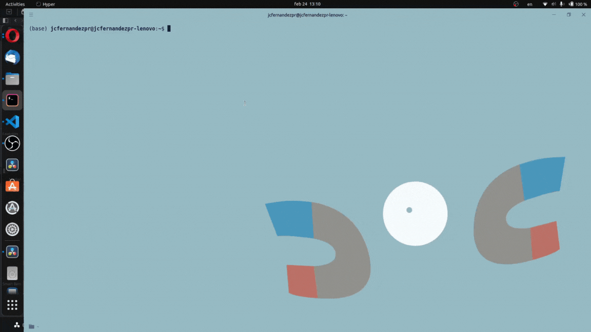

### Initialize Git Versioning and GitHub Repository

Now that those are installed and configured, I initialized my code Git versioning, added the current files I had, took a snapshot of my code by making a commit, and pushed them to a new GitHub repository.

```bash
# Initialize my code folder with git on branch production as my main branch
git init -b production

# Add the current files to Git
# If you wish to add everything, run 'git add .'
git add index.html
git add Dockerfile
git add test/*

# Take a snapshot of the current code
git commit -m 'first commit MVP'
```

Then I created the GitHub repository and pushed the code.

```bash
# Create a GitHub repository
gh repo create --source=. --public

# Create the branch into GitHub and push the code
git push --set-upstream origin production
```

On my [GitHub repo page](https://github.com/jcfernandezpr/webpage-devops) on the web browser I was able to see my new repository with the files I added.

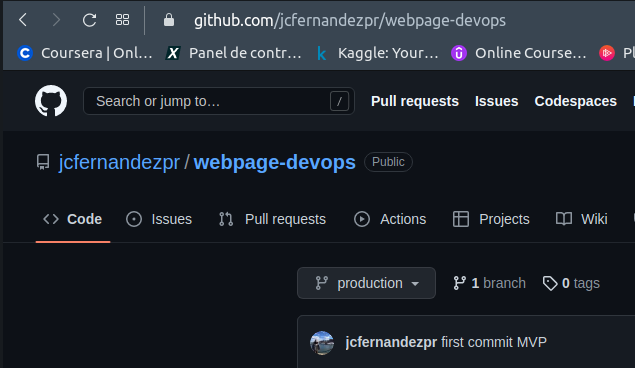

Once I had set up my GitHub repository, I started to create my deployment environments. Feel free to explore all the functionalities that GitHub has for you.

### Deployment Branches

My current webpage is horrible but the point is to get it better. To get to the desired state of the page I need to start adding code and making changes but since I don't want those changes to break my page or deliver un-tested features, I need to create deplyment environments that are nothing more than a combination of hardware, software, data, and configurations to run tests and host my application. For example, I may want to a run test of my webpage being accessible from the internet (like the test file I did) or build it on top of a Windows server, etc.

There are several environments I can set like dev, testing, integration, staging, pre-production, etc. They all have different purposes. If you'd like to know more about deployment environments, read [this Wiki page](https://en.wikipedia.org/wiki/Deployment_environment).

In this experience I only set up 4 environments:

- Local: My computer workstation (We already did!). 
- Dev: Changes from all the developers (hopefully not only me) will be combined in this environment to do testing and integrations.
- Staging: A mirror to production that serves to check how production will look or it's looking.
- Production: The actual server and page that will be exposed to the world.

If you want to create more environments like separate testing from dev, feel free to do it. Now let me show you how I created my environments.

To create a logical separation of dev/staging/production and I already have a `production` branch, I created the two new Git branches: `dev` and `staging`.

```bash
# Create and push staging branch
git checkout -b staging
git push --set-upstream origin staging

# Create and push dev branch
git checkout -b dev
git push --set-upstream origin dev
```

I went to the GitHub repo I was able to see my 2 new branches.

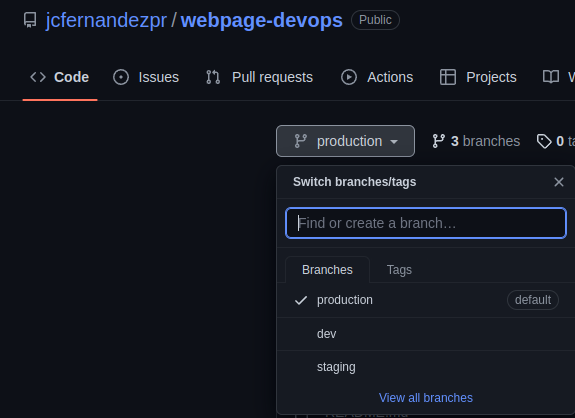

I started using the `dev` branch to construct the CI/CD pipelines and I promoted the changes to `staging` and `production`.

## Continuous Integration Pipeline

Continuous Integration refers that every time someone (or me) requests to make changes into a deployment branch the automated builds and tests are run to check everything works well. There are a lot of services and tools for CI pipelines like Jenkins, TravisCI, CircleCI, etc. I used [GitHub Actions](https://github.com/features/actions) since, as the name suggests, it's a native CI tool that integrates easily with GitHub repositories, it's easy to use and very practical. Feel free to look at the [docs here](https://docs.github.com/en/actions/quickstart) to get a glimpse.

To create a new workflow that runs my dummy test script, I created a folder `.github/workflows` and I looked for the most suitable [starter workflow here](https://github.com/actions/starter-workflows/) and modify it to my needs. I finally added my basic CI file [here](.github/workflows/basic_test_ci.yml). 

```bash
# Create workflow folder
mkdir .github
mkdir .github/workflows

# Create workflow YAML file
touch .github/workflows/basic_test_ci.yml

# Populate CI file
cat > .github/workflows/basic_test_ci.yml << EOF
name: CI Pipeline - Web Page Tests for jcfernandezpr.co

on:
  push:
    branches: 
      - dev
      - staging
      - production
  pull_request:
    branches: 
      - dev
      - staging
      - production

permissions:
  contents: read

jobs:
  build:
    runs-on: ubuntu-latest

    steps:
    - uses: actions/checkout@v3
    - name: Setup Nginx
      run: |
        sudo apt install nginx
        sudo systemctl start nginx
    - name: Changes index page
      run: |
        sudo rm /var/www/html/*.html
        sudo cp index.html /var/www/html/index.html
    - name: Run the tests
      run: bash test/test_curl.sh 
    - name: See page
      run: curl localhost
EOF
```

Then I pushed the code changes to the `dev` branch.

```bash
# In dev branch, add CI file and push it
git switch dev
git add .github/workflows/basic_test_ci.yml
git commit -m 'first CI test'
git push
```

Once I pushed the file, I went to the `Actions` tab on the GitHub repo page and I find the execution of the test:

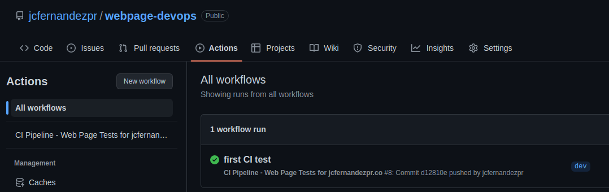

And I clicked on the workflow execution and looked at the steps and I saw the page that was being served was the correct one:

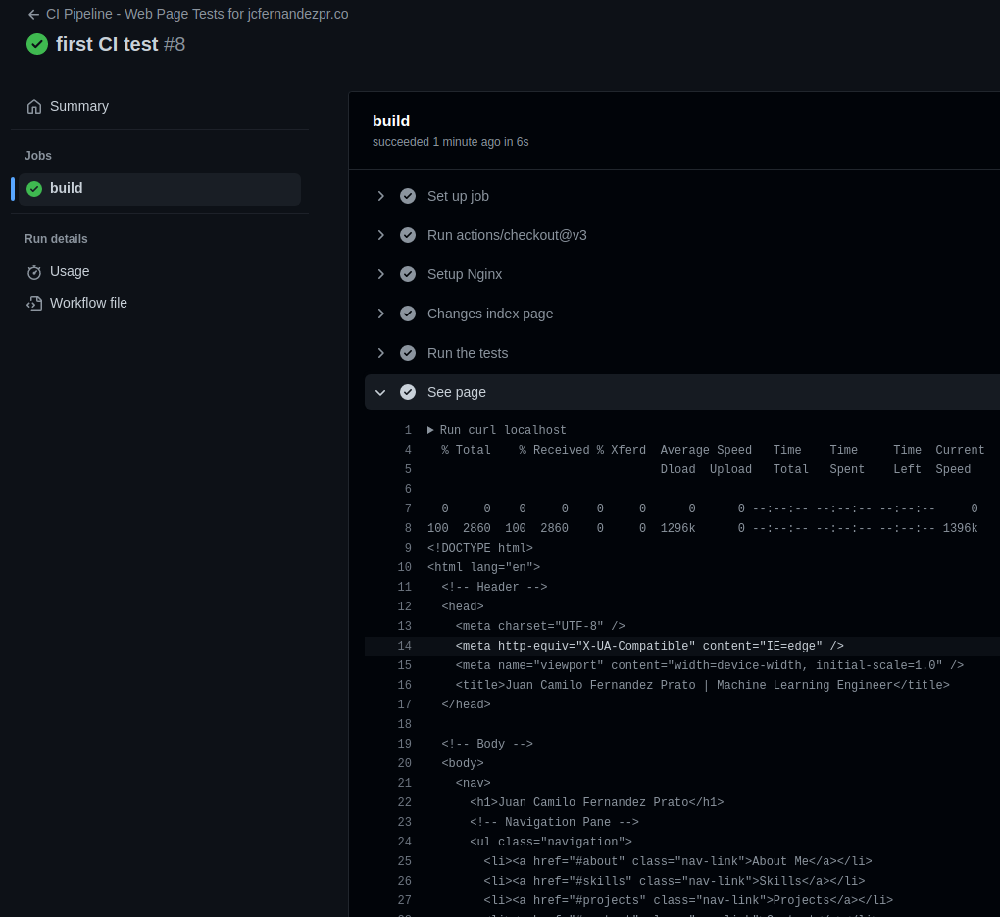

Of course as long as my webpage increases complexity my tests as well, but for now it's fine. I got my first CI pipeline set up for my webpage!

## Continuous Delivery Pipeline

Now that I got my super-hyper-mega basic test to run on the CI pipeline and being run every time I make a push or PR to my branches, I set up the CD pipeline to build the docker image and push it to the AWS Elastic Container Registry (ECR) repository.

> Note: For this part I assume you already have an AWS Account where you can create an ECR repository, if you don't have an AWS account, create one for free [here](https://aws.amazon.com).

### Create ECR Repositories

To create the ECRs for each environment you can use either the web AWS GUI (AWS Console), the AWS CLI, or the AWS SDK. I choose the AWS CLI since those can be scripted in a bash script so I can re-run it as needed for each environment.  

Also, I needed my AWS credentials. If you don't know where to get those, follow [this guide](https://docs.aws.amazon.com/powershell/latest/userguide/pstools-appendix-sign-up.html) to get them.

I first installed and configured the AWS CLI.

```bash
# Install the AWS CLI
sudo apt install awscli

# Configure AWS Credentials. When asked copy and paste the Key and Secret
aws configure
```

Then I ran the same lines in [`ecr-script.sh`](scripts/ecr-script.sh) in my terminal for the `dev`, `staging`, and `production` environments. Make sure to change the variables or names before you run them. If you wish you can also run `bash ecr-script.sh dev`.

```bash
# Variables
STAGE=dev
ECR_REPO_NAME=jcfernandezpr-webpage-docker-repo

# Create ECR repository
aws ecr create-repository --repository-name $ECR_REPO_NAME-$STAGE --region us-east-1
```

Once I created the ECR repositories, I was able to find them in the AWS UI.

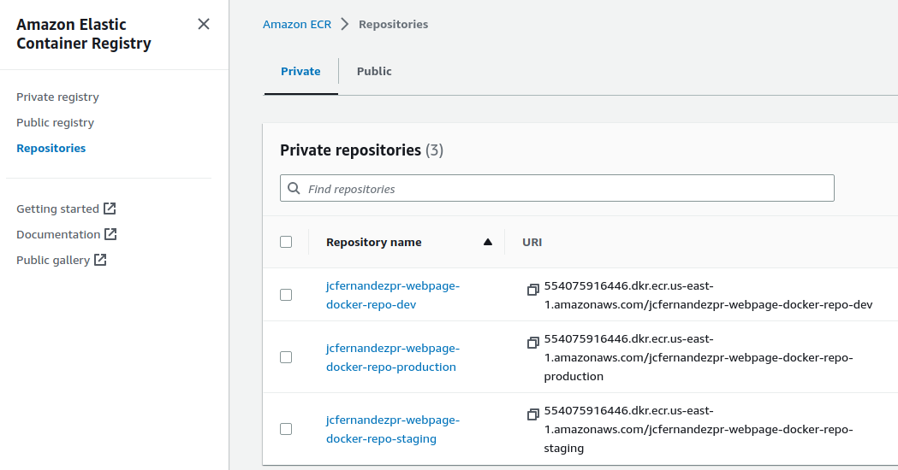

### Create CD Pipeline

After the repositories were created, I started doing the CD pipeline. Same as the CI, I created a file [`basic_deploy_cd.yml`](.github/workflows/basic_deploy_cd.yml) inside the `.github/workflow` folder with the commands to build the docker image and push it to the ECR. 

```bash
# Create CD file
touch .github/workflows/basic_deploy_cd.yml

# Populate CD file
cat > .github/workflows/basic_deploy_cd.yml << EOF
name: CD Pipeline - Build Docker and Push to ECR

on:
  push:
    branches:
      - production
      - staging
      - dev

env:
  AWS_REGION: us-east-1
  ECR_REPOSITORY: jcfernandezpr-webpage-docker-repo-${{ github.ref_name }}

permissions:
  contents: read

jobs:
  deploy:
    name: Deploy
    runs-on: ubuntu-latest
    environment: ${{ github.ref_name }}

    steps:
    - name: Checkout
      uses: actions/checkout@v3
    
    - name: Set current date as env variable
      run: echo "TIMESTAMP=$(date -u +'%Y-%m-%dT%H:%M:%SZ' | tr ':' '-')" >> $GITHUB_ENV

    - name: Configure AWS credentials
      uses: aws-actions/configure-aws-credentials@v1
      with:
        aws-access-key-id: ${{ secrets.AWS_ACCESS_KEY_ID }}
        aws-secret-access-key: ${{ secrets.AWS_SECRET_ACCESS_KEY }}
        aws-region: ${{ env.AWS_REGION }}

    - name: Login to Amazon ECR
      id: login-ecr
      uses: aws-actions/amazon-ecr-login@v1

    - name: Build, tag, and push image to Amazon ECR
      id: build-image
      env:
        ECR_REGISTRY: ${{ steps.login-ecr.outputs.registry }}
        IMAGE_TAG: ${{ env.TIMESTAMP }}-${{ github.sha }}
      run: |
        docker build -t $ECR_REGISTRY/$ECR_REPOSITORY:$IMAGE_TAG --build-arg stage=${{ github.ref_name }} .
        docker push $ECR_REGISTRY/$ECR_REPOSITORY:$IMAGE_TAG
        echo "image=$ECR_REGISTRY/$ECR_REPOSITORY:$IMAGE_TAG" >> $GITHUB_OUTPUT
EOF
```

### Environments and Credentials

As you can see on the file, there are some credentials that I needed to configure first before pushing it to the GitHub repo. It's never a good practice to hardcode your important credentials into a file. So for that, the GitHub environment feature lets you set the secrets and some environment variables for your deployment pipeline to be customizable. 

I went to the GitHub repo page, then clicked on `Settings` -> `Environmets`, and created a new environment for `dev`, `staging`, and `production`. On each environment I added the collaborators allowed to approve the deployment, the branches allowed to trigger a deployment, the AWS Credentials (used the same for all environments but you can use differnt accounts if you have) under the `Secrets` section, and some variables to use in the CD pipeline. Feel free to add more if you need them.


After I had set up the GitHub environment and the file for the CD pipeline, I commited the changes, and pushed them to the remote GitHub repository.

### CD Workflow

```bash
# Add new CD file, commit and pust to git
git add .github/workflows/basic_deploy_cd.yml
git commit -m 'first CD test'
git push
```

Once I pushed the changes, I was able to see the new workflow and I noticed that the status is `waiting`. 

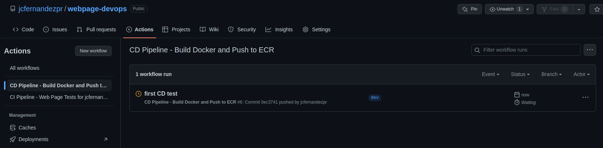

Each deployment may need approval or not, depending on your needs. I approved my deployment and the workflow started to run.

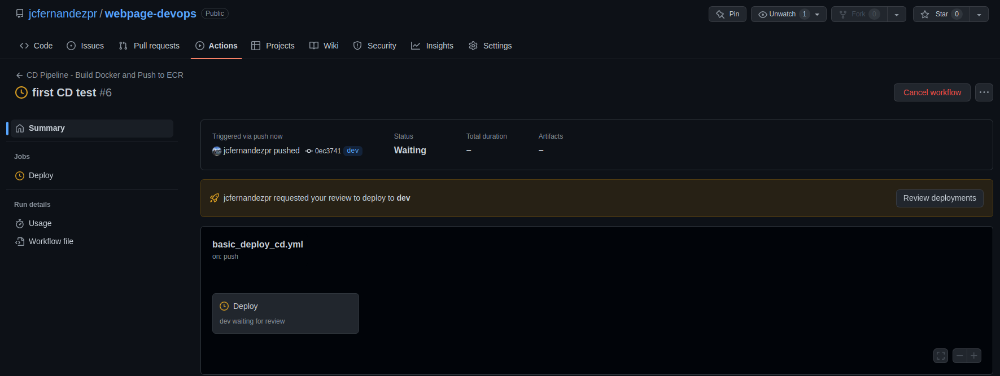

After the deployment ran, I was able to see the white check mark indicating everything went well.

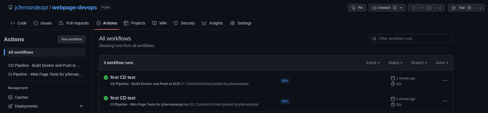

To make sure, I went to the ECR page, clicked on the repository `jcfernandezpr-webpage-docker-repo-dev` and I was able to see the docker image.

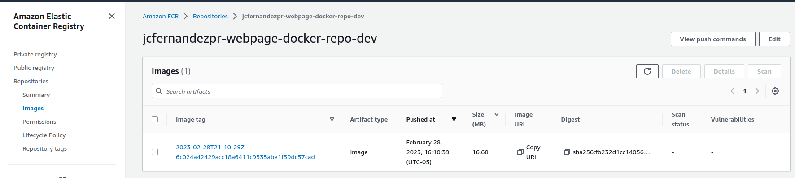

I have set up my first CD pipeline! I hope you can do it as well.

### Protecting Branches

A final note to keep in mind is that I protected my deployment branches from direct code push or any other undesired behaviour that may affect my environments.

To protect my branches I went to the repo GitHub page, clicked on `Settings` -> `Branches` -> `Add branch protection rule`, then typed the name of the branch I want to protect and selected the options that suited me the most.

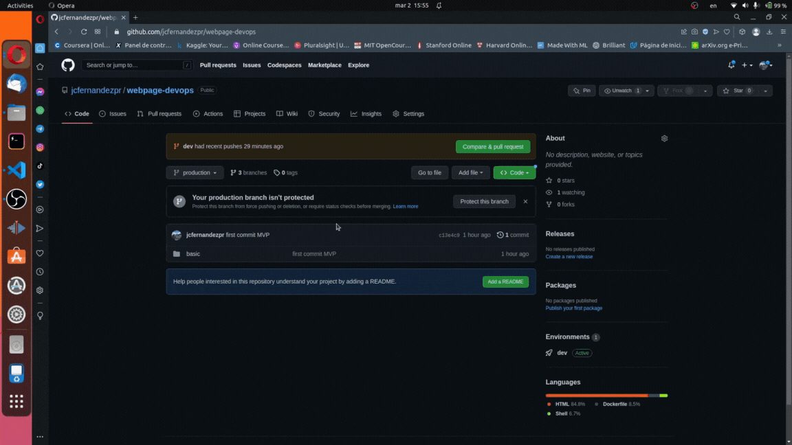

## Deploying and Exposing the Webpage

Now that the docker image for the basic page is being saved into the ECR repository, you need to deploy it to your infrastructure with a DNS Domain (i.e. jcfernandezpr.co). If you don't have a whole pipeline to deploy and mantain the infrastructure to host your web page, please refer to the [GitOps repository](https://github.com/jcfernandezpr/infra-gitops) to do it.

### Deploy to Single Instance

### Deploy to K8s

## Upgrading my Page

## Final Thoughts
